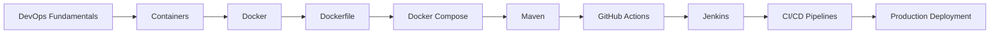

# 🚀 INT332: DEVOPS VIRTUALIZATION AND CONFIGURATION MANAGEMENT

<div align="center">


<br>

# 🛠 Complete DevOps Learning Repository

### Docker • Docker Compose • Maven • GitHub Actions • Jenkins • CI/CD


---

### 👨‍🎓 Academic Information

| Field | Details |
|---------|---------|
| 📘 Course | INT332 – DevOps Virtualization and Configuration Management |
| 🏫 University | Lovely Professional University |
| 🎓 Program | B.Tech Computer Science & Engineering |
| 👩‍💻 Maintained By | Komal Joshi |
| 📂 Repository Type | Notes + Labs + Projects + Viva + Interview Preparation |
| 📈 Coverage | Complete Course Coverage |

</div>

---

# 📖 About This Repository

This repository contains comprehensive notes, practical exercises, commands, projects, viva questions, interview preparation material, and real-world examples covering the complete syllabus of **INT332 – DevOps Virtualization and Configuration Management**.

The content is structured unit-wise and includes both theoretical concepts and practical implementations used in modern DevOps environments.

This repository can be used as:

- 📚 Academic Notes
- 💻 Lab Manual
- 🎯 Viva Preparation Guide
- 💼 Interview Preparation Resource
- 🚀 DevOps Learning Roadmap
- 🛠 Practical Reference Guide

---

# 🎯 Course Learning Outcomes

After completing this repository, learners will be able to:

✅ Understand DevOps principles and workflows

✅ Understand virtualization and containerization

✅ Work with Docker and Docker Compose

✅ Create and manage Docker Images

✅ Write optimized Dockerfiles

✅ Manage Docker Networking and Storage

✅ Build Java applications using Maven

✅ Manage dependencies and plugins

✅ Implement Continuous Integration using GitHub Actions

✅ Create automated CI pipelines

✅ Build enterprise-grade CI/CD pipelines using Jenkins

✅ Integrate Docker, Maven, GitHub, and Jenkins

✅ Deploy applications to servers and cloud environments

---

# 🧰 Technology Stack

<div align="center">

| Technology | Purpose |
|------------|----------|
| 🐳 Docker | Containerization |
| 🏗 Docker Compose | Multi-Container Applications |
| ☕ Maven | Build Automation |
| 🌐 Git & GitHub | Version Control |
| ⚡ GitHub Actions | Continuous Integration |
| 🔥 Jenkins | Continuous Delivery & Deployment |
| 🐧 Linux | Container Runtime Environment |
| 📦 Docker Hub | Container Registry |
| 🏢 GitHub Container Registry (GHCR) | Image Registry |
| 🚀 CI/CD | Software Delivery Automation |

</div>

---

# 🛤 Learning Journey



---

# 📂 Repository Structure

```text
INT332/

│
├── Unit_1_DevOps_Basics/
│
├── Unit_2_Image_Building_And_Container_Management/
│
├── Unit_3_Microservices_And_Docker_Compose/
│
├── Unit_4_Maven_Build_Automation/
│
├── Unit_5_GitHub_Actions/
│
├── Unit_6_Jenkins_CICD/
│
└── README.md
```

---

# 📚 Unit I – Basics of DevOps Infrastructure

## Topics Covered

### DevOps Fundamentals
- Introduction to DevOps
- Need for DevOps
- DevOps Lifecycle
- Agile vs DevOps
- Lean vs DevOps

### Containers & Virtualization
- Evolution of Application Architecture
- Virtual Machines vs Containers
- Container Runtime

### Linux Internals
- Process Isolation
- Namespaces
- cgroups

### Docker Fundamentals
- Docker Architecture
- Docker Daemon
- Docker CLI
- Docker Hub

### Docker Object Types
- Images
- Containers
- Networks
- Volumes

### Storage & Filesystem
- Docker Layers
- OverlayFS
- Copy-On-Write

### Practicals
- Docker Commands
- Container Interaction
- Practice Questions

✅ Unit Status: Complete

---

# 🐳 Unit II – Image Building & Container Management

## Topics Covered

### Dockerfile Concepts
- Build Context
- .dockerignore
- Docker Build Process

### Dockerfile Instructions
- FROM
- RUN
- COPY
- ADD
- CMD
- ENTRYPOINT
- WORKDIR
- ENV
- EXPOSE
- VOLUME

### Image Management
- Tagging
- Versioning
- Image History
- Layer Inspection

### Docker Networking
- Bridge Network
- Host Network
- Overlay Network
- DNS
- Port Mapping

### Docker Storage
- Volumes
- Bind Mounts
- Persistent Data

### Registries
- Docker Hub
- GHCR
- Private Registries
- Authentication Tokens

### Practicals
- Storage Labs
- Registry Labs
- Docker Projects

✅ Unit Status: Complete

---

# 🏗 Unit III – Microservices & Docker Compose

## Topics Covered

### Architecture Evolution
- Monolithic Architecture
- Component-Based Architecture
- Microservices Architecture

### Docker Compose
- Compose Fundamentals
- YAML Structure
- Services
- Networks
- Volumes
- Environment Variables

### Commands
- compose up
- compose down
- compose build
- compose logs
- compose restart

### Practical Examples
- Nginx + MySQL
- Node.js + MongoDB
- Multi-Service Deployments

### Best Practices
- Compose Design
- Environment Management
- Production Guidelines

✅ Unit Status: Complete

---

# ☕ Unit IV – Maven Build Automation

## Topics Covered

### Maven Fundamentals
- Why Build Tools Exist
- Maven Architecture
- Build Automation

### Project Object Model
- pom.xml
- Dependencies
- Plugins

### Build Lifecycle
- validate
- compile
- test
- package
- verify
- install
- deploy

### Dependency Management
- Dependency Scope
- Transitive Dependencies
- Version Conflicts
- Resolution Strategies

### Maven Plugins
- Compiler Plugin
- Surefire Plugin
- Shade Plugin

### Maven Wrapper
- mvnw
- Wrapper Benefits

### Maven + Docker
- Docker Integration
- Dockerized Java Applications

### Practicals
- Maven Projects
- Packaging Labs

✅ Unit Status: Complete

---

# ⚡ Unit V – Continuous Integration with GitHub Actions

## Topics Covered

### CI Fundamentals
- Continuous Integration
- Workflow Automation

### GitHub Actions Components
- Workflows
- Jobs
- Steps
- Actions
- Runners

### Workflow Triggers
- push
- pull_request
- schedule
- workflow_dispatch

### Advanced Workflows
- Matrix Builds
- Multi-Job Pipelines
- Caching

### Runners
- GitHub Hosted Runners
- Self Hosted Runners

### Docker Integration
- Docker Build
- Docker Hub Push
- GHCR Push

### Deployment
- Server Deployment
- Cloud Deployment

### Practicals
- Workflow Labs
- CI Pipelines

✅ Unit Status: Complete

---

# 🔥 Unit VI – CI/CD with Jenkins

## Topics Covered

### Jenkins Foundations
- Introduction to Jenkins
- Architecture
- Controller-Agent Model
- Installation
- Dashboard

### Security & Administration
- Plugin Management
- User Management
- Credentials
- Security

### Pipelines
- Freestyle Jobs
- Pipeline Jobs
- Declarative Pipeline
- Scripted Pipeline
- Jenkinsfile

### Pipeline Stages
- Checkout
- Build
- Test
- Package
- Deploy

### Docker Integration
- Docker Build
- Docker Agents
- Docker Hub
- GHCR

### Maven Integration
- Maven Installation
- Build Execution
- Reports
- Coverage

### GitHub Integration
- Webhooks
- PollSCM
- Multi-Branch Pipelines

### Deployment
- SSH Agents
- Container Agents
- Cloud Deployment

### Backup & Recovery
- Jenkins Backup
- Restore Strategies

### Practicals
- Jenkins Labs
- CI/CD Projects

✅ Unit Status: Complete

---

# 📊 Repository Progress Dashboard

| Unit | Topic | Status |
|--------|--------|---------|
| Unit I | DevOps Infrastructure | ✅ |
| Unit II | Image Building & Container Management | ✅ |
| Unit III | Docker Compose & Microservices | ✅ |
| Unit IV | Maven Build Automation | ✅ |
| Unit V | GitHub Actions (CI) | ✅ |
| Unit VI | Jenkins (CI/CD) | ✅ |

---

## Overall Completion

```text
████████████████████████████████████ 100%
```

---

# 🚀 Practical Coverage

This repository includes:

✅ Docker Commands

✅ Dockerfile Projects

✅ Docker Compose Labs

✅ Maven Projects

✅ GitHub Actions Workflows

✅ Jenkins Pipelines

✅ Docker Hub Integration

✅ GitHub Container Registry (GHCR)

✅ Multi-Container Applications

✅ End-to-End CI/CD Projects

---

# 🎓 Viva Preparation Included

Topics Covered:

- DevOps Concepts
- Virtualization
- Containers
- Docker Architecture
- Docker Networking
- Docker Storage
- Docker Compose
- Maven Lifecycle
- Maven Plugins
- GitHub Actions
- Jenkins Architecture
- Jenkins Pipelines
- CI/CD Concepts
- Docker Hub
- GHCR

---

# 💼 Interview Preparation Included

Frequently Asked Areas:

- DevOps Lifecycle
- Docker Internals
- Namespaces & cgroups
- Docker Networking
- Docker Storage
- Docker Compose
- Maven Lifecycle
- Dependency Management
- GitHub Actions
- Jenkins Pipelines
- CI/CD Architecture
- Jenkins + Docker
- Jenkins + Maven
- Docker Registries

---

# 🏆 Key Highlights

✨ Complete Unit-wise Notes

✨ Hands-on Labs

✨ Real-World Examples

✨ Docker Projects

✨ Maven Projects

✨ GitHub Actions Workflows

✨ Jenkins CI/CD Pipelines

✨ Viva Questions

✨ Interview Questions

✨ Industry-Oriented Content

---

# 📈 DevOps Roadmap Covered

```text
DevOps
   ↓
Containers
   ↓
Docker
   ↓
Dockerfile
   ↓
Docker Compose
   ↓
Maven
   ↓
GitHub Actions
   ↓
Jenkins
   ↓
CI/CD
   ↓
Production Deployment
```

---

# 👨‍💻 Author

### Komal Joshi

🎓 B.Tech Computer Science & Engineering

🏫 Lovely Professional University

📚 INT332 – DevOps Virtualization and Configuration Management

---

<div align="center">

## ⭐ Repository Status: COMPLETE

### 🚀 From DevOps Fundamentals to Enterprise CI/CD

**Docker • Docker Compose • Maven • GitHub Actions • Jenkins**

If you found this repository useful, consider giving it a ⭐

**Happy Learning & Happy Building! 🚀**

</div>
