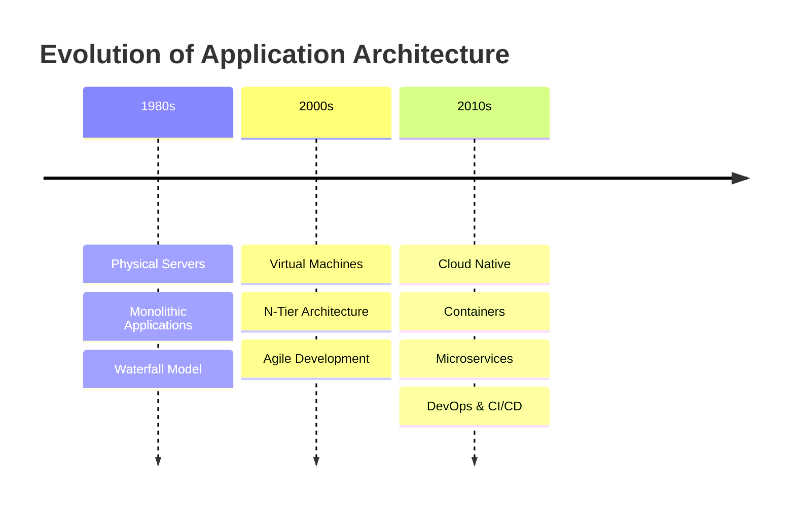

# Evolution of Application Architecture


---

# 📚 Table of Contents

- [Overview](#-overview)
- [Phase 1 – Physical Servers Era](#-phase-1--physical-servers-era-1980s--mid-1990s)
- [Phase 2 – Virtualization Era](#-phase-2--virtualization-era-late-1990s--2000s)
- [Phase 3 – Cloud Native Era](#-phase-3--cloud-native-era-2010--present)
- [Architecture Evolution Timeline](#-architecture-evolution-timeline)
- [Comparative Analysis](#-comparative-analysis)
- [Key Metrics Comparison](#-key-metrics-comparison)
- [Impact on Software Development](#-impact-on-software-development)
- [Business Impact](#-business-impact)
- [Technical Impact](#-technical-impact)
- [Quick Revision Notes](#-quick-revision-notes)
- [Viva Questions](#-viva-questions)
- [Conclusion](#-conclusion)

---

# 📖 Overview

Application architecture has evolved significantly over time due to changing business requirements, technological advancements, scalability needs, and cloud computing innovations.

The evolution of application architecture can be divided into **three major phases**:

1. Physical Servers Era
2. Virtualization Era
3. Cloud Native & Microservices Era

Each phase improved:
- Scalability
- Deployment speed
- Resource utilization
- Reliability
- Cost efficiency

---

# 🖥️ Phase 1 – Physical Servers Era (1980s – Mid 1990s)

## Infrastructure

- Applications were deployed on **physical servers**
- Hardware was owned and managed by organizations
- Servers were installed in on-premises data centers

---

## Application Model

### Monolithic Architecture

A monolithic application is a single large application where:
- UI
- Business Logic
- Database Access

are tightly coupled together.

---

## Development Methodology

### Waterfall Model

Development followed sequential phases:

```text
Requirement → Design → Development → Testing → Deployment
```

---

## Characteristics

| Feature | Description |
|---|---|
| Deployment | Manual |
| Scaling | Vertical Scaling |
| Cost | Very High |
| Flexibility | Low |
| Resource Usage | Poor |
| Maintenance | Difficult |
| Failure Handling | Entire application affected |

---

## Problems in This Era

- Expensive hardware
- Difficult scaling
- Long deployment cycles
- Downtime during maintenance
- Poor resource utilization

---

## Example

```text
A banking application runs on one large server.

If the server crashes:
→ Entire banking system goes down.
```

---

# 🖥️ Phase 2 – Virtualization Era (Late 1990s – 2000s)

## Infrastructure

Virtualization technology allowed:
- Multiple Virtual Machines (VMs)
- On a single physical server

This improved:
- Hardware utilization
- Cost efficiency
- Scalability

---

## Popular Virtualization Technologies

| Technology | Company |
|---|---|
| VMware | VMware Inc. |
| Hyper-V | Microsoft |
| KVM | Linux |

---

## N-Tier Architecture

Applications were divided into layers:

```text
Presentation Layer
Business Logic Layer
Database Layer
```

---

## Agile Methodology

Waterfall was replaced by Agile development.

### Agile Features

- Iterative development
- Sprint planning
- Faster feedback
- Continuous improvement

---

## Improvements Over Physical Servers

| Improvement | Benefit |
|---|---|
| Virtual Machines | Better resource utilization |
| Faster provisioning | Quick server creation |
| Reduced cost | Less hardware needed |
| Horizontal scaling | Multiple VMs |
| Better backup | Easier disaster recovery |

---

## Example

```text
50 physical servers replaced by:
→ 5 physical servers running 50 VMs
```

---

# ☁️ Phase 3 – Cloud Native Era (2010 – Present)

## Infrastructure

Modern applications use:
- Cloud Computing
- Containers
- Microservices
- Kubernetes

Popular cloud providers:

| Provider | Platform |
|---|---|
| AWS | Amazon Web Services |
| Azure | Microsoft Azure |
| GCP | Google Cloud Platform |

---

# 🔹 Microservices Architecture

Applications are divided into:
- Small independent services
- Each service performs one business function

Example:

```text
E-commerce Application

→ User Service
→ Payment Service
→ Order Service
→ Notification Service
```

---

# 🔹 Containerization

## Docker Containers

Containers package:
- Application
- Dependencies
- Runtime
- Libraries

Benefits:
- Lightweight
- Portable
- Fast deployment

---

# 🔹 Kubernetes

Kubernetes is used for:
- Container orchestration
- Auto scaling
- Self-healing
- Load balancing

---

# 🔹 DevOps & CI/CD

Modern software development uses:

| Practice | Purpose |
|---|---|
| CI | Continuous Integration |
| CD | Continuous Deployment |
| IaC | Infrastructure as Code |
| DevOps | Development + Operations |

---

# 🌍 Architecture Evolution Timeline



---

# 📊 Comparative Analysis

| Feature | Phase 1 | Phase 2 | Phase 3 |
|---|---|---|---|
| Infrastructure | Physical Servers | Virtual Machines | Cloud & Containers |
| Architecture | Monolithic | N-Tier | Microservices |
| Deployment | Manual | Semi-Automated | Automated |
| Scaling | Vertical | Horizontal | Auto Scaling |
| Cost | Very High | Medium | Pay-as-you-go |
| Reliability | Low | Medium | High |
| Deployment Speed | Slow | Faster | Very Fast |
| Maintenance | Difficult | Easier | Easy |
| Flexibility | Low | Medium | High |

---

# 📈 Key Metrics Comparison

| Metric | 1980s | 2000s | 2020s |
|---|---|---|---|
| Deployment Time | Months | Weeks | Minutes |
| Release Frequency | 1-2/year | Monthly | Daily |
| Infrastructure Cost | Very High | Medium | Optimized |
| Scalability | Difficult | Easier | Automatic |
| Downtime | High | Medium | Minimal |
| Resource Utilization | Poor | Better | Excellent |

---

# 💻 Impact on Software Development

## 1980s

- Manual deployments
- Slow development cycles
- Large teams
- Difficult maintenance

---

## 2000s

- Agile development
- Faster releases
- Improved scalability
- Better testing

---

## 2020s

- DevOps culture
- Continuous Deployment
- Automated testing
- Cloud-native applications

---

# 📦 Business Impact

## Advantages for Organizations

```text
✔ Faster product delivery
✔ Lower infrastructure cost
✔ Better customer experience
✔ Rapid scaling
✔ Global availability
```

---

# ⚙️ Technical Impact

```text
✔ Independent services
✔ Fault isolation
✔ Better scalability
✔ Easier debugging
✔ Faster deployments
```

---

# 📝 Quick Revision Notes

| Phase | Key Technology | Architecture |
|---|---|---|
| Phase 1 | Physical Servers | Monolithic |
| Phase 2 | Virtualization | N-Tier |
| Phase 3 | Cloud & Containers | Microservices |

---

# 🎯 Important Keywords

- Monolithic Architecture
- Microservices
- Virtualization
- Docker
- Kubernetes
- DevOps
- CI/CD
- Cloud Computing
- Scalability
- Containerization

---

# ❓ Viva Questions

## Basic Questions

1. What is application architecture?
2. What is monolithic architecture?
3. What are microservices?
4. What is virtualization?
5. What is containerization?
6. What is Docker?
7. What is Kubernetes?
8. Difference between VM and Container?
9. What are advantages of microservices?
10. What is CI/CD?

---

# 🧠 Interview Questions

| Question | Short Answer |
|---|---|
| Why microservices are popular? | Scalability and flexibility |
| Why Docker is used? | Application portability |
| What is cloud-native architecture? | Applications designed for cloud environments |
| What is DevOps? | Collaboration between development and operations |

---

# 📌 Key Takeaway

Application architecture evolved from:

```text
Physical Servers
        ↓
Virtual Machines
        ↓
Cloud Native & Microservices
```

Modern architecture focuses on:
- Scalability
- Automation
- Faster deployment
- Fault tolerance
- Cloud computing

---

# ✅ Conclusion

The evolution of application architecture transformed software development from slow, hardware-dependent systems into highly scalable cloud-native applications.

Modern technologies like:
- Docker
- Kubernetes
- Microservices
- DevOps

allow organizations to:
- Deploy faster
- Scale automatically
- Reduce costs
- Improve reliability

This evolution forms the foundation of modern cloud computing and distributed systems.

---

# 🔗 Next Topic

➡️ Monolithic vs Microservices Architecture