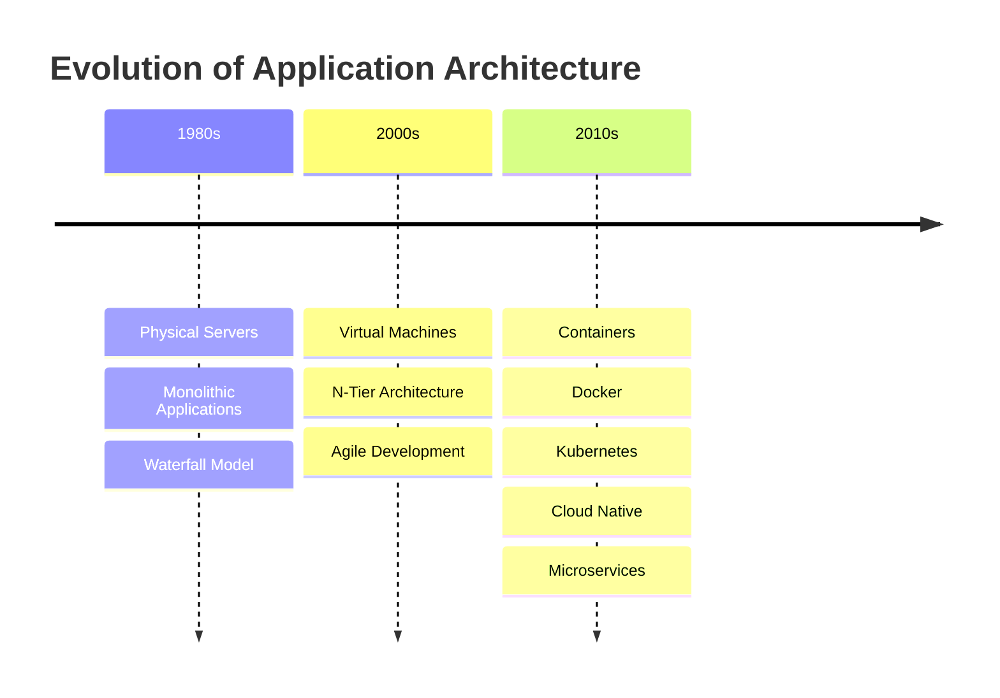

# 🚀 Unit 3: Microservices and Containers


---

# 📖 Overview

This repository contains complete study notes and practical implementations for **Unit 3: Microservices and Containers**.

The repository covers:
- Evolution of Application Architecture
- Monolithic vs Microservices Architecture
- Containers and Virtualization
- Docker Compose
- Multi-container deployments
- Real-world practical examples

These notes are designed for:
- University exams
- Viva preparation
- Interview preparation
- DevOps learning
- Docker and Microservices fundamentals

---

# 📚 Topics Covered

---

## 1️⃣ [Evolution of Application Architecture](01_Evolution_of_Application_Architecture.md)

### Topics Included

- Physical Servers Era
- Virtualization Era
- Cloud Native Era
- Architecture evolution timeline
- Waterfall vs Agile
- Transition to Microservices

### Key Concepts

```text
Physical Servers
        ↓
Virtual Machines
        ↓
Containers & Cloud Native
```

---

## 2️⃣ [Monolithic Applications](02_Monolithic_Applications.md)

### Topics Included

- Definition of monolithic architecture
- Core layers of monolithic applications
- Business logic layer
- Data access layer
- Advantages and disadvantages
- Scaling challenges

### Key Concepts

```text
✔ Single codebase
✔ Shared database
✔ Tight coupling
✔ Simple deployment
```

---

## 3️⃣ [Microservices Architecture](03_Microservices_Architecture.md)

### Topics Included

- Microservices principles
- API Gateway
- Loose coupling
- Database-per-service pattern
- Independent deployment
- Fault isolation

### Real-World Examples

- Amazon
- Netflix
- Uber
- Spotify

### Key Concepts

```text
✔ Independent services
✔ API communication
✔ Scalability
✔ Fault isolation
✔ Technology flexibility
```

---

## 4️⃣ [Containers](04_Containers.md)

### Topics Included

- What are containers?
- Container lifecycle
- Containers vs Virtual Machines
- Namespaces and cgroups
- Container portability
- Kubernetes overview

### Key Concepts

```text
✔ Lightweight virtualization
✔ Fast startup
✔ Resource efficiency
✔ Isolation
✔ Portability
```

---

## 5️⃣ [Docker Compose](05_Docker_Compose.md)

### Topics Included

- What is Docker Compose?
- Multi-container applications
- docker-compose.yml
- Compose architecture
- Service orchestration

### Key Concepts

```text
✔ Multi-container management
✔ YAML configuration
✔ Automatic networking
✔ Simplified deployment
```

---

## 6️⃣ [Docker Compose — Building Blocks](06_Docker_Compose_Building_Blocks.md)

### Topics Included

- YAML structure
- Services
- Volumes
- Networks
- Ports
- Environment variables
- Restart policies
- Health checks

### Key Concepts

```text
✔ Services
✔ Images
✔ Build
✔ Volumes
✔ Networks
✔ Environment Variables
```

---

## 7️⃣ [Docker Compose — Essential Commands](07_Docker_Compose_Commands.md)

### Topics Included

- Initialization commands
- Starting and stopping services
- Logs and monitoring
- Debugging containers
- Scaling containers
- Docker Compose workflows

### Important Commands

```bash
docker compose up -d
docker compose down
docker compose ps
docker compose logs -f
docker compose exec web bash
```

---

## 8️⃣ [Practical Examples](08_Practical_Examples.md)

### Real-World Projects Included

---

### 🔹 Example 1: Node.js + MongoDB

Features:
- Backend API
- MongoDB integration
- Persistent storage
- Environment variables

---

### 🔹 Example 2: WordPress + MySQL

Features:
- CMS deployment
- Database persistence
- Volume management
- Backup workflow

---

### 🔹 Example 3: React + Spring Boot + PostgreSQL

Features:
- Full-stack architecture
- Frontend + Backend + Database
- Health checks
- Multi-service communication

---

# 🎯 Quick Navigation

| Topic | Description |
|---|---|
| [Architecture Evolution](01_Evolution_of_Application_Architecture.md) | Evolution from physical servers to cloud-native systems |
| [Monolithic Applications](02_Monolithic_Applications.md) | Traditional tightly coupled architecture |
| [Microservices Architecture](03_Microservices_Architecture.md) | Distributed scalable architecture |
| [Containers](04_Containers.md) | Lightweight virtualization |
| [Docker Compose](05_Docker_Compose.md) | Multi-container orchestration |
| [Building Blocks](06_Docker_Compose_Building_Blocks.md) | YAML structure and components |
| [Commands](07_Docker_Compose_Commands.md) | Essential Docker Compose commands |
| [Practical Examples](08_Practical_Examples.md) | Real-world deployments |

---

# 🛣️ Recommended Learning Path

---

# Step 1️⃣

Start with:

## 📘 [Evolution of Application Architecture](01_Evolution_of_Application_Architecture.md)

Understand how application architecture evolved.

---

# Step 2️⃣

Learn traditional systems:

## 📘 [Monolithic Applications](02_Monolithic_Applications.md)

Understand limitations of monolithic systems.

---

# Step 3️⃣

Learn modern architecture:

## 📘 [Microservices Architecture](03_Microservices_Architecture.md)

Understand distributed systems and scalability.

---

# Step 4️⃣

Learn infrastructure technology:

## 📘 [Containers](04_Containers.md)

Understand containerization and Docker concepts.

---

# Step 5️⃣

Learn orchestration:

## 📘 [Docker Compose](05_Docker_Compose.md)

Understand multi-container management.

---

# Step 6️⃣

Deep Dive:

## 📘 [Docker Compose — Building Blocks](06_Docker_Compose_Building_Blocks.md)

Learn services, volumes, networks, and YAML.

---

# Step 7️⃣

Practice commands:

## 📘 [Docker Compose — Essential Commands](07_Docker_Compose_Commands.md)

Master Docker Compose CLI.

---

# Step 8️⃣

Build projects:

## 📘 [Practical Examples](08_Practical_Examples.md)

Implement real-world applications.

---

# 📊 Architecture Evolution Diagram



---

# 🏗️ Microservices Architecture Overview

```text
                    ┌───────────────────┐
                    │   API Gateway     │
                    └─────────┬─────────┘
                              │
      ┌──────────┬────────────┼───────────┬──────────┐
      │          │            │           │          │
      ▼          ▼            ▼           ▼          ▼

 ┌────────┐ ┌────────┐ ┌────────┐ ┌────────┐ ┌────────────┐
 │ User   │ │ Order  │ │Payment │ │Product │ │Notification│
 │Service │ │Service │ │Service │ │Service │ │Service     │
 └────────┘ └────────┘ └────────┘ └────────┘ └────────────┘
```

---

# 🐳 Docker Compose Workflow

```text
Write docker-compose.yml
            ↓
docker compose build
            ↓
docker compose up -d
            ↓
Services Running
            ↓
docker compose logs -f
            ↓
docker compose down
```

---

# 🚀 Quick Command Reference

---

# Start Services

```bash
docker compose up -d
```

---

# View Running Containers

```bash
docker compose ps
```

---

# Stream Logs

```bash
docker compose logs -f
```

---

# Execute Commands Inside Container

```bash
docker compose exec <service> bash
```

---

# Stop Services

```bash
docker compose down
```

---

# Build Images

```bash
docker compose build
```

---

# Restart Services

```bash
docker compose restart
```

---

# 📦 Technologies Covered

| Technology | Purpose |
|---|---|
| Docker | Containerization |
| Docker Compose | Multi-container orchestration |
| Kubernetes | Container orchestration |
| Node.js | Backend development |
| MongoDB | NoSQL database |
| MySQL | Relational database |
| PostgreSQL | Enterprise database |
| React | Frontend development |
| Spring Boot | Java backend framework |

---

# 🎓 Learning Outcomes

After completing this repository, you will understand:

---

## Architecture Concepts

```text
✔ Monolithic architecture
✔ Microservices architecture
✔ Cloud-native systems
✔ Distributed systems
```

---

## Containerization

```text
✔ Containers
✔ Docker
✔ Container lifecycle
✔ Virtualization
✔ Kubernetes basics
```

---

## Docker Compose

```text
✔ YAML configuration
✔ Multi-container orchestration
✔ Services
✔ Networks
✔ Volumes
✔ Environment variables
```

---

## Practical Skills

```text
✔ Deploying applications
✔ Running databases in containers
✔ Full-stack deployments
✔ Container networking
✔ Persistent storage
✔ Debugging containers
```

---

# 📌 Important Concepts Summary

| Topic | Key Idea |
|---|---|
| Monolithic | Single large application |
| Microservices | Independent services |
| Containers | Lightweight virtualization |
| Docker Compose | Multi-container management |
| Volumes | Persistent storage |
| Networks | Service communication |
| Environment Variables | Dynamic configuration |
| Health Checks | Service monitoring |

---

# 🧠 Important Keywords

- Microservices
- Docker
- Docker Compose
- Containers
- Kubernetes
- Virtualization
- API Gateway
- YAML
- Volumes
- Networks
- Scalability
- CI/CD
- Cloud Native
- DevOps

---

# ❓ Viva Questions

1. What are microservices?
2. Difference between monolithic and microservices?
3. What are containers?
4. Difference between VM and container?
5. What is Docker Compose?
6. What is docker-compose.yml?
7. What are volumes in Docker?
8. What are networks in Docker Compose?
9. What is an API Gateway?
10. Why are microservices scalable?

---

# 💼 Interview Questions

| Question | Answer |
|---|---|
| Why use microservices? | Scalability and flexibility |
| Why use Docker? | Portability and isolation |
| Purpose of Docker Compose? | Multi-container management |
| Why use volumes? | Persistent storage |
| Why use environment variables? | Dynamic configuration |
| What is container orchestration? | Managing containers at scale |

---

# 🌟 Repository Highlights

```text
✔ Beginner Friendly
✔ Exam-Oriented Notes
✔ Viva Preparation
✔ Interview Questions
✔ Real-World Examples
✔ Docker Compose Projects
✔ Architecture Diagrams
✔ Practical Workflows
```

---

# 🛡️ Best Practices

- Use specific image versions
- Avoid hardcoded credentials
- Use `.env` files
- Use named volumes
- Add health checks
- Keep containers lightweight
- Use restart policies
- Monitor logs regularly

---

# 📌 Key Takeaway

This repository provides a complete understanding of:

```text
Traditional Architecture
            ↓
Microservices
            ↓
Containers
            ↓
Docker Compose
            ↓
Modern Cloud-Native Applications
```

It combines:
- Theory
- Architecture concepts
- Docker fundamentals
- Practical implementation
- Real-world deployments

into one structured learning repository.

---

# ✅ Conclusion

Modern applications require:
- Scalability
- Flexibility
- Fast deployment
- Reliability

Technologies like:
- Docker
- Containers
- Microservices
- Docker Compose

help developers build:
- Cloud-native applications
- Distributed systems
- Full-stack applications
- Enterprise-grade deployments

This repository serves as a complete guide for mastering:
- Microservices architecture
- Containers
- Docker Compose
- Multi-container deployments

---

# 👩‍💻 Author

**Komal Joshi**  
B.Tech CSE Student  
Learning DevOps • Docker • Microservices • Cloud Technologies

---

# ⭐ Support

If you found this repository helpful:

```text
⭐ Star the repository
🍴 Fork the repository
📚 Share with friends
🚀 Keep learning
```

---

# 📅 Repository Information

| Detail | Value |
|---|---|
| Subject | Open Minor |
| Unit | Unit 3 |
| Topic | Microservices and Containers |
| Last Updated | May 2026 |
| Version | 1.0 |
